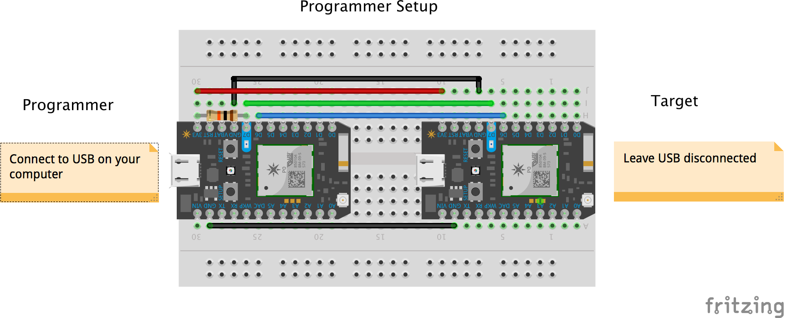
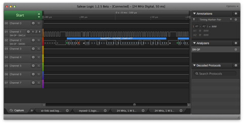

# Embedded SWD

The Embedded SWD library allows you to use a working Particle device to repair the bootloader on another (non-functioning) device. This would normally require a programmer shield, but we can achieve the same thing using an additional device, a few connecting wires and a 10K resistor. 

If you have a device that is unresponsive, just showing a dim blue D7 LED, then this library may help you revive it.

## Using the example app to Revive a Dead Device

> -- No no he's not dead, he's, he's restin'! Remarkable bird, the Norwegian Blue, idn'it, ay? Beautiful plumage!

In the examples folder is an example called "Norwegian_Blue". It repairs the bootloader on a Particle Photon, P1 or Electron device by using a working device as a flash programmer. Note that you only need to do this if your device does not show any sign of life on the main LED - if the LED lights up then the bootloader is good. This also includes use of DFU mode - if you can get the device into DFU mode the bootloader is good, and you do not need ot use this process.

Ok, so caveats out the way, you have a dead parrot, and you want to revive it using another particle device. Your dead device is called the "target". You'll also need another working device, which we call the "programmer".

In addition to these devices you'll also need:

- 5 breadboard jumper cables
- a 10K-100K resistor
 
### Assembly
 
Assembly is quite straightforward.

Each connection is between a pin on the programmer and the corresponding pin on target. For example, D6 is connected, so we connect, D6 on the programmer to D6 on the target.
 
 
 - 3V3
 - GND (left side)
 - GND (right side)
 - D6
 - D7

Finally, a 10K resistor is required (brown, black, orange colors). This is connected between D7 on the programmer device and 3V3.

The fritzing digram shows how it should look after assembly

### Setup the Programmer App

The next step is to flash the programmer app to the programmer device. (Recall the programmer device is the device that's working normally.)

The simplest way is to use the Particle WebIDE:

- Click the libraries drawer
- Type "SWD" into the search field, click "SWD" when it appears in the list below
- Click on the "Norwegian Blue" example
- Click "Use this example"
- Click "Flash" to flash the example to your device
 
Alternatively, you can download the latest release for your programmer device from the [Releases](https://github.com/m-mcgowan/embedded-swd/releases) page on GitHub. 

Once the app has been flashed, the device will show a steady blue LED. The device doesn't connect to the cloud or use Wi-Fi. 
 
### Using the Programmer App

- Open a serial terminal to the device.
- Press a key
- Read the messages that appear. 
- If you're sure you want to continue flashing the target device, type `Y` and press return.
- Follow the on-screen prompts.
- Once flashing is complete, your target device should be showing signs of life via the main LED! The programmer LED turns green.

# Developers

## Handy Bits for Reuse

The library has some useful parts that may be generally useful:

- An implementation of the SWD protocol
- A wire driver abstraction for give the protocol a physical binding
- An implementation of the wire driver that uses GPIOs for the clock and data signals.
- An implementation of the Debug Port and Access Port types
- An implementation of the MEM_AP port
- A flash memory binding for the STM32F2xx that allows flash operations to be performed. (This is presently limited to reflashing the bootloader.)

By resuing this, you'll save yourself a few hours staring at a logic analyser... :-)

